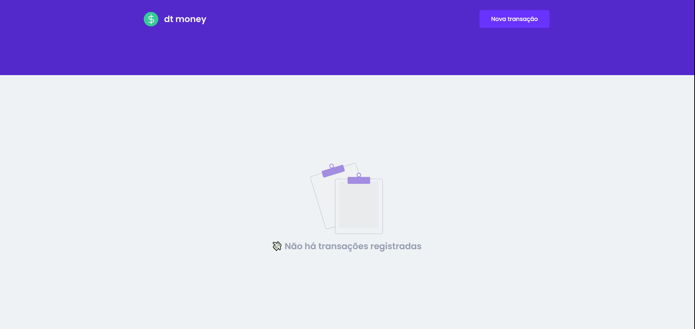

<div align='center'>
  
  <p>Aplicação web de controle de transações financeiras</p>
</div>



---

## Sobre
A <a href='dt-money-app.netlify.app/' target='_blank'>dt.money</a> é uma aplicação web para controle de transações financeiras desenvolvida com React durante o <a href='https://www.rocketseat.com.br/ignite'>Ignite</a>.

## Objetivo
Recriar do zero, por conta própria, e com mais funcionalidades uma aplicação controle de transações financeiras desenvolvida durante o Chapter 2 do <a href='https://www.rocketseat.com.br/ignite'>Ignite</a>.

## Tecnologias utilizadas
- Create React App (CRA);
- Eslint (Standard);
- Husky;
- TypeScript;
- React.js;
- Localforage;
- Styled components.

## Ideias de implementação
- [ ] Implementação de uma funcionalidade para tema claro e escuro
- [ ] Funcionalidade que permita ao usuário editar uma transação
- [ ] Tela de login
- [ ] Armazenamento das transações em um banco de dados

## Como usar
### Passo 01: Clonando a aplicação
Neste você executará o comando abaixo para clonar os arquivos deste repositório em sua máquina, afim de que possa também usá-lo localmente.

```bash
$ git clone https://github.com/sou-gabriel/dt.money.git
```

### Passo 02: Instalando as dependências do projeto
No seu gerenciador de pacotes preferido execute um dos comandos abaixo para instalar todas as dependências necessárias para o funcionamento da aplicação.

```bash
$ yarn
# ou
$ npm install
```

### Passo 03: Levantando um servidor local
Executando um dos comandos abaixo será levantado um servidor de desenvolvimento na sua porta 3000: <a href="http://localhost:3000/" target="_blank">http://localhost:3000/</a>.

```bash
$ yarn dev
# ou
$ npm run dev
```

---

Feito com ❤️ por Gabriel Ramos 👋🏽 Entre em contato!

[](https://www.linkedin.com/in/sou-gabriel/) 
[](mailto:dev.gabrielramos@gmail.com)

